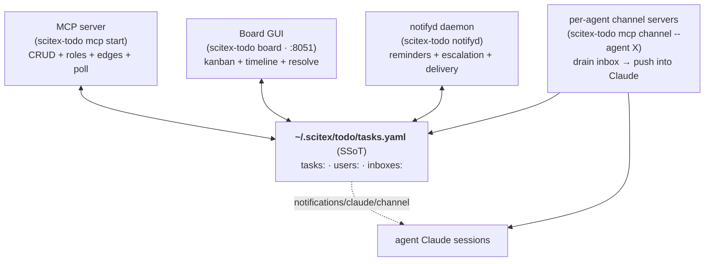
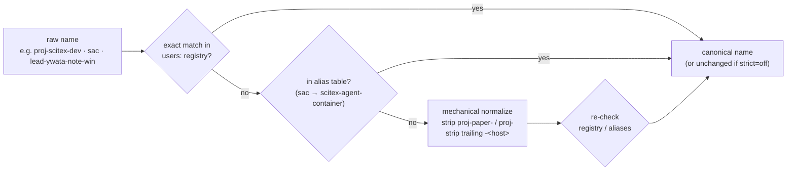
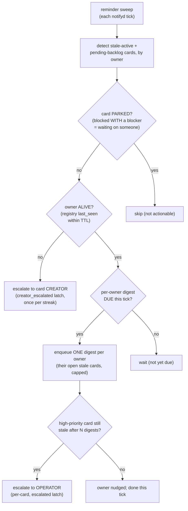

# scitex-todo (`scitex-todo`)

<p align="center">
  <a href="https://scitex.ai">
    
  </a>
</p>

<p align="center"><b>A standalone, YAML-backed fleet task board — the single source of truth for tasks <em>and</em> the agent-to-agent communication medium that rides on top of the cards.</b></p>

<p align="center">
  <a href="https://scitex-todo.readthedocs.io/">Full Documentation</a> · <code>uv pip install scitex-todo[all]</code>
</p>

<!-- scitex-badges:start -->
<p align="center">
  <a href="https://pypi.org/project/scitex-todo/"></a>
  <a href="https://pypi.org/project/scitex-todo/"></a>
  <a href="https://img.shields.io/readthedocs/scitex-todo?label=docs"></a>
</p>
<p align="center">
  <a href="https://github.com/ywatanabe1989/scitex-todo/actions/workflows/pytest-matrix-on-ubuntu-py3-11-3-12-3-13.yml"></a>
  <a href="https://github.com/ywatanabe1989/scitex-todo/actions/workflows/import-smoke-on-ubuntu-py3-12.yml"></a>
  <a href="https://github.com/ywatanabe1989/scitex-todo/actions/workflows/scitex-dev-quality-audit-on-ubuntu-latest.yml"></a>
  <a href="https://codecov.io/gh/ywatanabe1989/scitex-todo"></a>
</p>
<!-- scitex-badges:end -->

---

## What it is

`scitex-todo` is a **standalone YAML task board** for a fleet of agents and humans. One
plain-YAML file at `~/.scitex/todo/tasks.yaml` is the single source of truth (SSoT), holding
three top-level sections in one document:

- `tasks:` — the cards (dependency graph, statuses, roles, comments).
- `users:` — the user registry (stable ids + display-name aliases; humans and agents alike).
- `inboxes:` — the per-recipient PULL notification queues (the delivery rail).

It is **two things at once**:

1. **A task store** — cards with `depends_on` / `blocks` edges, rendered as a dependency graph
   or as a kanban board.
2. **A communication medium** — every card mutation (comment, reassign, complete, a git-linked
   push …) becomes a card-event that is resolved to a set of recipients and enqueued into their
   inboxes. Each agent runs a small **channel server** that drains its inbox and pushes the
   notification straight into its Claude session. The cards *are* the message bus.

**Hard standalone constraint.** The package has ZERO dependency on any external agent runtime
or fleet package (no `sac` / `claude-code-telegrammer` imports, in either direction). The
delivery rail is a PULL inbox persisted in the same YAML file, so it works with no network and
no external service present. An out-of-band push accelerator is always OPTIONAL, never a
dependency.

## Architecture

The YAML store sits at the center. Every other component is a producer or consumer that reads
(and, for a few, writes) that one file — no component owns the data.



<sub><b>Figure 1.</b> The store is the hub. The MCP server, board GUI, and notifyd all read and
write it; each agent's channel server drains its slice of the <code>inboxes:</code> section and
pushes into that agent's Claude session.</sub>

### Where your task data lives (store resolution)

The store is resolved by the precedence chain (first existing wins), from `scitex_todo._paths`:

| Precedence | Source | Path |
|---|---|---|
| 1 | explicit `--tasks` flag / function arg | any path (wins even if missing) |
| 2 | `$SCITEX_TODO_TASKS` | any path |
| 3 | project scope | `<git-root>/.scitex/todo/tasks.yaml` |
| 4 | user scope (the shared-fleet default) | `$SCITEX_DIR/todo/tasks.yaml` (default `~/.scitex/todo`) |
| 5 | bundled generic example | `scitex_todo/examples/tasks.yaml` |

Runtime state (pidfiles, the delivery ledger, the reminder sidecar) lives under
`<store-dir>/runtime/` (gitignored); the notify + reminder sidecars (`notify.yaml`,
`reminders.yaml`) live next to `tasks.yaml`.

## The card and its roles

A card carries four **roles** (ADR-0009). Each role feeds the notify resolver:

| Role | Card field | Meaning |
|---|---|---|
| `owner` | `agent` (falls back to `assignee`) | the agent/human responsible for the card |
| `assignee` | `assignee` | the legacy owner field, also targetable on its own |
| `collaborators` | `collaborators[]` | working with the owner; subscribed to the thread by default |
| `subscribers` | `subscribers[]` | watching the card; get thread + lifecycle notices |

Roles are mutated through first-class verbs — `set_collaborator`, `set_subscriber`,
`reassign_task` — on the MCP surface, the CLI, and the board.

### The user registry + identity resolver

A role member is a name string, but names drift (`proj-scitex-dev`, `scitex-dev`,
`lead-ywata-note-win`, `sac`, `scitex-agent-container` …). The `users:` registry
(`scitex_todo._users`) gives every member a **stable id** (`u_` + 12 hex) plus a `names[]`
alias list, an optional `host_at_name` join key, and a `last_seen` liveness stamp. Renaming an
owner no longer breaks references — the id is durable, the display name is just an alias.

`canonical_identity` (`_users/_identity.py`) collapses drift to ONE canonical name:



<sub><b>Figure 2.</b> Identity resolution: exact registry match → declared alias table →
mechanical normalize (prefix/host strip) → re-check. Non-strict by default, so an unregistered
owner resolves to itself rather than raising.</sub>

## Communication flow

A card mutation is the message. This is the full path from a mutation to a notification landing
in a recipient's Claude session — with NO synchronous network on the mutation's critical path.

```mermaid
sequenceDiagram
    participant A as Actor<br/>(agent / human / board)
    participant S as Store mutation<br/>(comment_task, reassign, complete …)
    participant E as emit() → hook bus<br/>(card-event C1)
    participant R as resolve_recipients<br/>(notify C3, PURE)
    participant Q as enqueue → inboxes:<br/>(dispatch C4, PULL)
    participant C as Recipient channel server<br/>(scitex-todo mcp channel)
    participant CL as Recipient Claude session

    A->>S: mutate a card
    S->>E: emit canonical card-event<br/>{type, card_id, actor}
    E->>R: resolve recipients for this event + card
    Note over R: roles → members, then<br/>per-user mute/watch, then<br/>per-card add/mute overrides;<br/>drop the actor
    R-->>Q: recipient id set
    loop per recipient (fail-soft)
        Q->>Q: append record to inboxes[recipient_id]
    end
    Note over C,CL: PULL rail — no inbound POST to the mutation
    loop every ~5s
        C->>Q: drain unseen (poll_inbox)
        C->>CL: notifications/claude/channel<br/>(rendered "&lt;- scitex-todo")
        C->>Q: ack (mark seen) after successful push
    end
```

<sub><b>Figure 3.</b> Mutation → event → resolve → enqueue → drain → push. The enqueue is the
delivery; the recipient PULLs. A direct inbound POST cannot reach a containerized agent (it
subscribes outbound to a bus), so the PULL inbox is the always-works rail. Delivery is
fail-soft per recipient — one bad enqueue never breaks the others or the mutation.</sub>

### The three notify-config layers

`resolve_recipients` (`_notify/_resolver.py`) composes three layers, most-specific wins:

1. **Global defaults** — a built-in `{event_type: [role, …]}` map (`DEFAULT_NOTIFY_RULES`),
   optionally overridden by a `notify.yaml` sidecar. For example `commented` →
   owner + collaborators + subscribers; `completed` → owner + subscribers; `reassigned` →
   owner; `merged` → quiet by default (a merge that closes a card already fires `completed`).
2. **Per-user prefs** (`User.notify`) — `mute` opts a user OUT of an event type; `watch` opts
   them IN, but only on cards where they are already a member.
3. **Per-card overrides** (`card["notify"]`) — `events` replaces the role list on this card,
   `add` force-includes users, `mute` force-excludes them (the card's final word).

The actor (whoever caused the event) is always dropped — no one is notified of their own action.

### The delivery rail (PULL inbox + channel server)

- **Enqueue** (`_notify/_dispatch.py` → `_inbox.enqueue`) appends a record
  `{id, event_type, card_id, body, actor, ts, seen: false}` to `inboxes[recipient_id]` under
  the shared store lock, keyed by the resolved id (`u_*` or raw-name fallback). It dedups on
  `(event_type, card_id, ts, actor)`.
- **Drain** — each agent runs `scitex-todo mcp channel --agent X` (`_mcp_channel.py`), a
  low-level MCP stdio server. Every ~5s it polls the agent's inbox (both its raw name and its
  resolved `u_*` id, matching the producer's keys), pushes each record as a
  `notifications/claude/channel` JSON-RPC notification (rendered `<- scitex-todo` in the
  terminal), then acks it. Ack happens ONLY after a successful push, so a failed push is retried
  next drain.
- **Poll (alternative read path)** — the `poll_notifications` MCP tool returns an agent's inbox
  for a client that polls on its own turn instead of running a channel server; polling also
  stamps the agent's `last_seen` liveness heartbeat.

## Nudge / escalation

A carded task that silently stops progressing is a real incident, so `notifyd` runs a reminder
sweep (`_reminders.py`) that keeps surfacing stuck cards until they close — and escalates the
worst ones. It uses a `reminders.yaml` sidecar for cadence + escalation latches; card payloads
are never mutated.



<sub><b>Figure 4.</b> Reminder logic. Parked cards (blocked with a named blocker — waiting on
someone else) are excluded. A live owner gets a periodic single digest of their stale cards; a
high-priority card still stuck after N digests escalates to the operator; a card whose owner is
NOT alive escalates straight to the card's creator (the assignee will never act).</sub>

## The processes

`scitex-todo` is one CLI with several long-running roles. Each reads/writes the same store.

| Command | Role | What it does |
|---|---|---|
| `scitex-todo mcp start` | MCP server (stdio/HTTP) | Exposes the CRUD + roles + edges tools (`add_task`, `comment_task`, `update_task`, `complete_task`, `reassign_task`, `set_collaborator`, `set_subscriber`, `set_edge`, `resolve_task`, `list_tasks`, `poll_notifications`, …). Every tool is a thin wrapper over `scitex_todo._store` so MCP / CLI / GUI share one logic path. |
| `scitex-todo mcp channel --agent X` | per-agent channel server (stdio) | Drains agent `X`'s inbox and pushes `notifications/claude/channel` into its Claude session. Fail-loud on an unresolved agent id (never drains an `unknown`/blank inbox). |
| `scitex-todo notifyd` | always-on delivery + reminder daemon | Ticks the reminder sweep + delivery pass every `--interval` seconds under a single-instance lock; `--once` runs a single pass; `notifyd install-unit` writes an operator-gated systemd user unit. |
| `scitex-todo board [start] --port 8051` | board GUI (Django) | Serves the `board_v3` app (kanban columns, timeline, multi-select toolbar, resolve→notify). Lifecycle verbs `start` / `stop` / `restart` / `status` via a pidfile at `~/.scitex/todo/board.pid`. Embedded in the scitex-ui shell. |

The `mcp start` and `mcp channel` servers are launched by each agent's Claude Code `.mcp.json`
(`scitex-todo mcp install` / `install-fleet` writes the entries). `notifyd` runs as a systemd
user service; `board` is started by the operator or the UI shell.

## Quick Start

```python
import scitex_todo as todo

# Task CRUD + roles (the same functions the MCP tools wrap)
todo.add_task(None, id="c1", title="Wire the notify rail", status="in_progress")
todo.comment_task(None, "c1", "resolver done; dispatch next", by="alice")
todo.set_subscriber(None, task_id="c1", who="bob", action="add")
rows = todo.list_tasks(None, status="in_progress")
```

From the shell:

```bash
# default store: project -> user -> bundled example (or $SCITEX_TODO_TASKS)
scitex-todo render-graph -o tasks.png     # YAML -> dependency PNG
scitex-todo render-graph --print-mermaid  # inspect the mermaid without rendering
scitex-todo list-tasks --json             # resolved tasks, machine-readable

# communication surfaces
scitex-todo mcp start                     # MCP CRUD server (stdio)
scitex-todo mcp channel --agent proj-scitex-todo   # push inbox → Claude
scitex-todo notifyd --interval 120        # reminders + delivery daemon
scitex-todo board start --port 8051       # kanban / timeline GUI
```

## Installation

> **Recommended**: `uv pip install scitex-todo[all]` — uv's Rust resolver
> handles the SciTeX dep set quickly. Plain `pip install` still works.

```bash
# Recommended — uv resolver
uv pip install scitex-todo[all]

# Plain pip also works
pip install scitex-todo
```

Extras: `[mcp]` for the MCP + channel servers, `[web]` for the Django board. Rendering a PNG
additionally needs either `mmdc` (mermaid-cli, with a puppeteer/playwright chromium) on `PATH`,
or outbound access to `kroki.io` (the automatic fallback).

### Configuration

Copy [`.env.example`](.env.example) to `.env` (gitignored) at your project root, then edit. CLI
flags always override env vars; the full list of variables (with inline comments) lives in
`.env.example`. Notable ones for the fleet slice:

```bash
export SCITEX_TODO_TASKS=/path/to/tasks.yaml   # override the store outright
export SCITEX_TODO_AGENT='agent:<name>'        # this agent's identity (channel + author + last_seen)
export SCITEX_TODO_SCOPE='agent:<name>'        # default list/summary filter
```

## CLI reference

<details>
<summary><strong>Task store</strong></summary>

```bash
scitex-todo render-graph -o tasks.png       # YAML -> dependency PNG
scitex-todo list-tasks --json               # resolved tasks, machine-readable
scitex-todo list-tasks --assignee X --status pending --status in_progress
scitex-todo list-tasks --blocking-operator  # the operator's decision queue
scitex-todo list-python-apis -v             # introspect the Python surface
scitex-todo install-shell-completion        # bash/zsh/fish tab-completion
```

</details>

<details>
<summary><strong>Communication</strong></summary>

```bash
scitex-todo mcp start [--http --port N]     # CRUD + roles + poll tools
scitex-todo mcp doctor                      # self-diagnose the MCP install
scitex-todo mcp list-tools -vv              # enumerate registered tools
scitex-todo mcp install                     # print the .mcp.json snippet
scitex-todo mcp channel --agent X           # drain inbox → push into Claude
scitex-todo notifyd [--interval N | --once] # reminders + delivery daemon
scitex-todo notifyd install-unit            # write the systemd user unit (operator-gated)
```

</details>

<details>
<summary><strong>Web board</strong></summary>

```bash
pip install scitex-todo[web]
scitex-todo board start --port 8051         # kanban + timeline, opens http://127.0.0.1:8051/
scitex-todo board status | stop | restart   # pidfile-backed lifecycle
```

</details>

<details>
<summary><strong>Git hooks (git → card)</strong></summary>

Record local git mutations onto the matching card automatically. Install the `post-commit` +
`pre-push` hooks into any repo:

```bash
scripts/install-todo-git-hooks.sh          # wires hooks into the current repo
scripts/install-todo-git-hooks.sh --copy   # vendor hooks into <repo>/.githooks
scripts/install-todo-git-hooks.sh --uninstall
```

The hooks **soft-link**: a commit/push on a `<type>/<card-id>-…` branch (e.g.
`feat/tcfb-p3-git-to-card`) appends a `[push]` comment to that card via `scitex-todo hook push`,
which emits a `committed` / `pushed` card-event down the same notify rail. Commits on ad-hoc
branches are skipped silently — no card id, no error. To link a one-off commit, add a
`Card: <id>` trailer to the commit message. The hooks are best-effort and never block a commit
or push.

</details>

## Task store schema

A YAML document with a top-level `tasks:` list (plus the sibling `users:` / `inboxes:` sections
managed by the registry + inbox layers). Each task:

| Field        | Required | Meaning                                                          |
|--------------|----------|------------------------------------------------------------------|
| `id`         | yes      | unique id, referenced by `depends_on` / `blocks`                 |
| `title`      | yes      | short label                                                      |
| `status`     | yes      | `goal` \| `pending` \| `in_progress` \| `blocked` \| `done` \| `deferred` \| `failed` |
| `agent` / `assignee` | no | the card owner (role: `owner`)                              |
| `collaborators` / `subscribers` | no | role lists feeding the notify resolver              |
| `repo`       | no       | owning repo / area                                               |
| `depends_on` | no       | ids this task depends on -> arrow `dep --> task`                 |
| `blocks`     | no       | ids this task inhibits -> `blocker -- blocks --x target`         |
| `blocker`    | no       | who/what the card is waiting on (a card `blocked` WITH a blocker is "parked") |
| `note`       | no       | free-text annotation, shown under the title                     |
| `priority`   | no       | integer rank (lower = higher); document order if absent          |
| `parent`     | no       | id of the task this nests under (drill-down view)                |
| `comments`   | no       | the Gitea-compatible activity thread (`comment_task` appends)    |
| `notify`     | no       | per-card notify override (`events` / `add` / `mute`)             |
| `kind`       | no       | `task` (default) \| `compute` — `compute` marks a row updated by an external writer (Spartan/CI watcher) |
| `job_id` / `host` / `command` / `started_at` / `finished_at` | no | compute-job metadata; only with `kind: compute` |
| `deadline` / `deadlines` / `scheduled` | no | ISO-8601 deadline schema with optional `+1d`/`+1w`/`+1m`/`+1y` repeater |

### status -> color

| status        | fill            | edge style    |
|---------------|-----------------|---------------|
| `goal`        | gold `#ffe082`  | solid         |
| `done`        | green `#c8e6c9` | solid         |
| `in_progress` | yellow `#fff9c4`| solid         |
| `blocked`     | bright-orange `#ff8a65` | solid |
| `pending`     | grey `#eceff1`          | solid |
| `deferred`    | amber `#ffca28`         | dashed border |
| `failed`      | red `#ffcdd2`   | solid         |

## Part of SciTeX

`scitex-todo` is part of [**SciTeX**](https://scitex.ai).

>Four Freedoms for Research
>
>0. The freedom to **run** your research anywhere — your machine, your terms.
>1. The freedom to **study** how every step works — from raw data to final manuscript.
>2. The freedom to **redistribute** your workflows, not just your papers.
>3. The freedom to **modify** any module and share improvements with the community.
>
>AGPL-3.0 — because we believe research infrastructure deserves the same freedoms as the software it runs on.

---

<p align="center">
  <a href="https://scitex.ai" target="_blank"></a>
</p>
