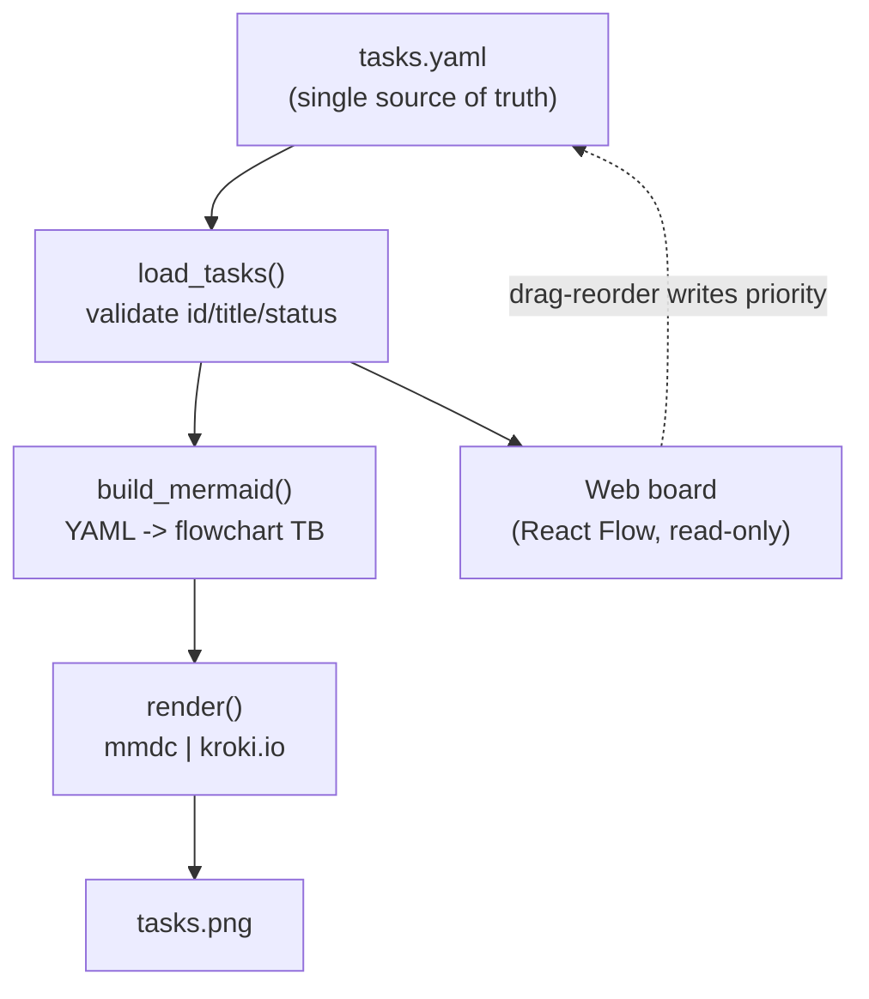

# scitex-todo (`scitex-todo`)

<p align="center">
  <a href="https://scitex.ai">
    
  </a>
</p>

<p align="center"><b>A canonical YAML task store with pluggable adapters — render your dependency graph as a diagram, not a wall of prose.</b></p>

<p align="center">
  <a href="https://scitex-todo.readthedocs.io/">Full Documentation</a> · <code>uv pip install scitex-todo[all]</code>
</p>

<!-- scitex-badges:start -->
<p align="center">
  <a href="https://pypi.org/project/scitex-todo/"></a>
  <a href="https://pypi.org/project/scitex-todo/"></a>
  <a href="https://img.shields.io/readthedocs/scitex-todo?label=docs"></a>
</p>
<p align="center">
  <a href="https://github.com/ywatanabe1989/scitex-todo/actions/workflows/pytest-matrix-on-ubuntu-py3-11-3-12-3-13.yml"></a>
  <a href="https://github.com/ywatanabe1989/scitex-todo/actions/workflows/import-smoke-on-ubuntu-py3-12.yml"></a>
  <a href="https://github.com/ywatanabe1989/scitex-todo/actions/workflows/scitex-dev-quality-audit-on-ubuntu-latest.yml"></a>
  <a href="https://codecov.io/gh/ywatanabe1989/scitex-todo"></a>
</p>
<!-- scitex-badges:end -->

---

## Problem and Solution

| # | Problem | Solution |
|---|---------|----------|
| 1 | Prose **to-do lists hide the dependency structure** — what blocks what is buried in text. | A YAML store with explicit `depends_on` / `blocks`, rendered as a **dependency graph**. |
| 2 | Task tooling **locks your data into one app's format**. | A plain-YAML **single source of truth**; adapters render or import it, the store stays portable. |
| 3 | Switching views means **re-entering the same tasks**. | One store, **multiple adapters** — mermaid PNG today, a web board, org-mode on the roadmap. |

## Quick Start

```python
import scitex_todo as todo

tasks = todo.load_tasks("tasks.yaml")    # validates: id/title/status
mermaid_src = todo.build_mermaid(tasks)  # YAML -> flowchart TB
engine = todo.render(mermaid_src, "tasks.png")
print(f"rendered via {engine}")
```

From the shell:

```bash
# default store: project -> user -> bundled example (or $SCITEX_TODO_TASKS)
scitex-todo render-graph -o tasks.png

# inspect the generated mermaid without rendering
scitex-todo render-graph --print-mermaid

# list the resolved tasks (add --json for machine-readable output)
scitex-todo list-tasks
```

## Installation

> **Recommended**: `uv pip install scitex-todo[all]` — uv's Rust resolver
> handles the SciTeX dep set quickly. Plain `pip install` still works.

```bash
# Recommended — uv resolver
uv pip install scitex-todo[all]

# Plain pip also works
pip install scitex-todo
```

Rendering to PNG additionally needs either `mmdc` (mermaid-cli, with a
puppeteer/playwright chromium) on `PATH`, or outbound access to `kroki.io`
(the automatic fallback).

### Configuration

Copy [`.env.example`](.env.example) to `.env` (gitignored) at your project
root, then edit. CLI flags always override env vars; the full list of
variables (with inline comments) lives in `.env.example`.

<details>
<summary><strong>Local state directories</strong></summary>

<br>

`scitex-todo` resolves your task store from the canonical SciTeX local-state
locations (project-local wins; both optional):

| Path                              | Scope         | Purpose                        |
|-----------------------------------|---------------|--------------------------------|
| `~/.scitex/todo/tasks.yaml`       | user-global   | your personal task store (the shared-fleet default) |
| `<proj-root>/.scitex/todo/tasks.yaml` | project-local | overrides for the current repo |

</details>

<details>
<summary><strong>Shared-fleet TODO across agents</strong></summary>

<br>

The user-global store (`~/.scitex/todo/tasks.yaml`) is the **centralized**
list shared between you and every agent that runs on this host. Each task
carries an optional `scope:` label so an agent (or you, via the board) can
filter to only the slice that's relevant.

Convention (not enforced — `scope` is a free-form string):

- `agent:<name>` — "for this agent's eyes" (e.g. `agent:proj-scitex-todo`).
- `project:<name>` — "tied to this project" (e.g. `project:scitex-clew`).
- `private` — operator-only.

Each agent in the SciTeX agent container picks up its slice by setting:

```bash
export SCITEX_TODO_SCOPE='agent:<name>'   # default filter for `list`/`summary`
export SCITEX_TODO_AGENT='agent:<name>'   # stamps `completed_by` on `done`
```

The list-side filter ALSO has a per-call `--scope LABEL` flag. Pass
`--scope ''` (empty string) to opt out of the env default and see the
full store.

See `GITIGNORED/ARCHITECTURE.md` (in the repo working tree) for the
9-requirement → mechanism map and the deferred-but-designed seams
(cross-host sync, operator↔agent chat).

</details>

## Architecture

The YAML store is the canonical backend; everything else is an adapter that
reads (or, for the board, writes) it. No adapter owns the data.



<sub><b>Figure 1.</b> scitex-todo data flow: one YAML store feeds the mermaid
PNG adapter and the read-only web board.</sub>

## 3 Interfaces

<details open>
<summary><strong>Python API</strong></summary>

```python
import scitex_todo as todo

tasks = todo.load_tasks("tasks.yaml")
src = todo.build_mermaid(tasks)
todo.render(src, "tasks.png")
```

`load_tasks`, `save_tasks`, `build_mermaid`, `render`, `resolve_tasks_path`,
`bundled_example`, and the `STATUS_STYLE` / `VALID_STATUSES` tables are the
public surface (`scitex-todo list-python-apis`).

</details>

<details>
<summary><strong>CLI</strong></summary>

```bash
scitex-todo render-graph -o tasks.png      # YAML -> dependency PNG
scitex-todo list-tasks --json              # resolved tasks, machine-readable
scitex-todo board --port 8051              # read-only web board (needs [web])
scitex-todo list-python-apis -v            # introspect the Python surface
scitex-todo install-shell-completion       # bash/zsh/fish tab-completion
```

</details>

<details>
<summary><strong>Web board</strong></summary>

A browser view of the dependency graph, rendered with React Flow (nodes
colored by status, `depends_on` arrows, `blocks` ⊣ inhibition edges). Install
the web extra and launch the standalone server:

```bash
pip install scitex-todo[web]
scitex-todo board                          # opens http://127.0.0.1:8051/
```

</details>

<details>
<summary><strong>Git hooks (git → card)</strong></summary>

Record local git mutations onto the matching card automatically. Install the
`post-commit` + `pre-push` hooks into any repo:

```bash
scripts/install-todo-git-hooks.sh          # wires hooks into the current repo
scripts/install-todo-git-hooks.sh --copy   # vendor hooks into <repo>/.githooks
scripts/install-todo-git-hooks.sh --uninstall
```

The hooks **soft-link**: a commit/push on a `<type>/<card-id>-…` branch (e.g.
`feat/tcfb-p3-git-to-card`) appends a `[push]` comment to that card via
`scitex-todo hook push`. Commits on ad-hoc branches are skipped silently — no
card id, no error. To link a one-off commit on an ad-hoc branch, add a
`Card: <id>` trailer to the commit message. The hooks are best-effort and
never block a commit or push.

</details>

## Task store schema

A YAML document with a top-level `tasks:` list. Each task:

| Field        | Required | Meaning                                                          |
|--------------|----------|------------------------------------------------------------------|
| `id`         | yes      | unique id, referenced by `depends_on` / `blocks`                 |
| `title`      | yes      | short label                                                      |
| `status`     | yes      | `goal` \| `pending` \| `in_progress` \| `blocked` \| `done` \| `deferred` \| `failed` |
| `repo`       | no       | owning repo / area                                               |
| `depends_on` | no       | ids this task depends on -> arrow `dep --> task`                 |
| `blocks`     | no       | ids this task inhibits -> `blocker -- blocks --x target`         |
| `note`       | no       | free-text annotation, shown under the title                      |
| `priority`   | no       | integer rank (lower = higher); document order if absent          |
| `parent`     | no       | id of the task this nests under (drill-down view)                |
| `kind`       | no       | `task` (default) \| `compute` — closed enum; `compute` marks a row whose status is updated by an external writer (Spartan/CI watcher) |
| `job_id`     | no       | opaque compute-job id (slurm id, GH Actions run, …); only with `kind: compute`  |
| `host`       | no       | where the compute job runs (`spartan`, `mba`, `github`, …); only with `kind: compute` |
| `command`    | no       | shell invocation / pipeline for the compute job; only with `kind: compute`     |
| `started_at` | no       | ISO-8601 timestamp the writer observed start; only with `kind: compute`        |
| `finished_at`| no       | ISO-8601 timestamp the writer observed completion; only with `kind: compute`   |

### status -> color

| status        | fill            | edge style    |
|---------------|-----------------|---------------|
| `goal`        | gold `#ffe082`  | solid         |
| `done`        | green `#c8e6c9` | solid         |
| `in_progress` | yellow `#fff9c4`| solid         |
| `blocked`     | bright-orange `#ff8a65` | solid         |
| `pending`     | grey `#eceff1`          | solid         |
| `deferred`    | amber `#ffca28`         | dashed border |
| `failed`      | red `#ffcdd2`   | solid         |

## Roadmap

The YAML store is the canonical backend; adapters layer on top.

- **mermaid adapter** — YAML -> dependency PNG. *(done)*
- **Web UI (read-only board)** — browser view via React Flow. *(done)*
- **Web UI (drag-to-reprioritize)** — drag a task to change its `priority` and
  write back to the YAML store. *(in progress)*
- **org adapter** — read/write org-mode TODO trees (`:BLOCKER:` / `ORDERED` /
  org-edna) so deps are derivable from Emacs. *(future)*
- **MCP / HTTP / RTD / full skills** — agentic + service surfaces, intended to
  make the store a shared task backend across SciTeX (e.g. orochi). *(future)*

## Part of SciTeX

`scitex-todo` is part of [**SciTeX**](https://scitex.ai).

>Four Freedoms for Research
>
>0. The freedom to **run** your research anywhere — your machine, your terms.
>1. The freedom to **study** how every step works — from raw data to final manuscript.
>2. The freedom to **redistribute** your workflows, not just your papers.
>3. The freedom to **modify** any module and share improvements with the community.
>
>AGPL-3.0 — because we believe research infrastructure deserves the same freedoms as the software it runs on.

---

<p align="center">
  <a href="https://scitex.ai" target="_blank"></a>
</p>
